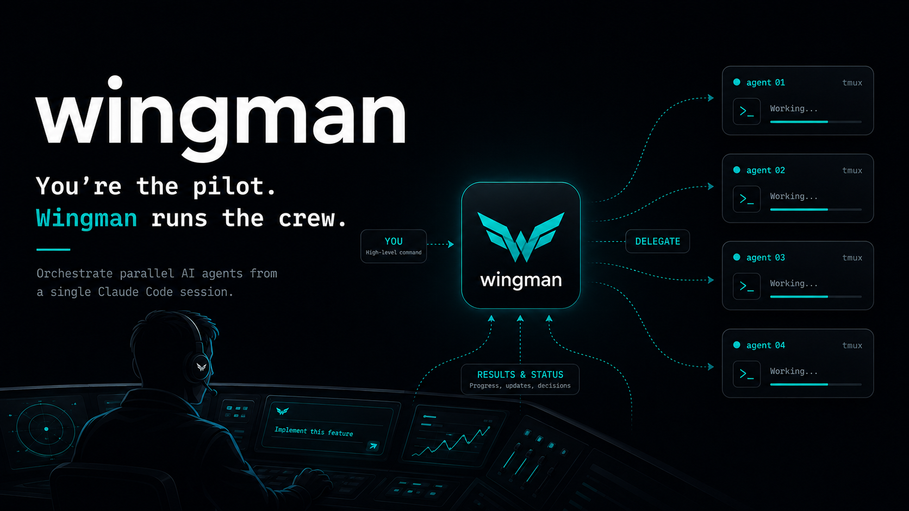

Wingman is a long-lived Claude Code session that runs a **crew** of agents for you.
You (the pilot) give it high-level directives - *"implement this feature"*, *"investigate this issue"*, *"what's my crew doing?"* - and it delegates the real work to a crew, tracks their status, raises only real decisions to you, and keeps its own context clean.
It orchestrates; it does not do the heavy lifting.

Each crew member is an **independent `claude` session in its own tmux window**, launched in your target repo - so you can watch it, type into it, or take it over live, and it survives even if wingman itself is killed.

## Quick start

```
git clone https://github.com/greerviau/wingman.git
cd wingman
claude          # or: bin/wingman   (adds your project roots via --add-dir)
```

On first launch wingman runs `bin/doctor` (installs any missing dependencies with your consent), discovers your sibling repos with zero config, and starts the supervisor.
Then give it a directive.

The only things you must have before the first run are **`claude`** and **`git`**; `doctor` handles the rest.

## Driving wingman

Talk to it in plain language, or use the slash commands:

| You say | Wingman does |
|---|---|
| "Implement feature X in `<repo>`" | spawns an **analyst** crew → plan → (your review) → **developer** crew → PR → the developer crew watches its PR through to merge/close |
| "Investigate issue Y in `<repo>`" | spawns an **analyst** crew in report mode (reproduces bugs end-to-end first) |
| "Take the lead on X" (big, end-to-end) | spawns a **lead** that hires and runs its own crew (analyst → architect → developers → reviewer) and rolls one status line up to you |
| `/spawn <type> <repo-or-global> <objective>` | launch a crew member of any type - `analyst`, `architect`, `developer`, `reviewer`, `lead`, `research`, or one you added; pass `global` instead of a repo for cross-repo work |
| `/status` | compact roster: who's on what (with each member's status), what's blocked, what's ready. Closed history is hidden by default |
| `/blocked` | each blocked member + the decision it needs |
| "Take over X" | `bin/crew-takeover <id>` prints the exact takeover command |
| `/standdown <id>` | wraps up a crew member, closes its window |
| `/prune` | clean the roster: drop fully-closed records (archived first) |

**One session sees its work through.** A crew member is not spun down the moment its deliverable appears.
When a developer crew opens a PR it parks in a `review` state and keeps running: it watches CI and fixes it if it breaks, watches for review feedback and addresses it (dropping back to `working` while it does), replies on the threads, and reports `done` only when the PR is merged or closed.
`done` is the member's own "stand me down" signal, so wingman reaps it right then - finished members don't linger.
Feedback you give wingman is routed back to that same session (not a fresh one), so it keeps the full context.
It stops early only if you `/standdown` it.
The same lifecycle applies to analyst and other crew types; how each state is entered lives in one shared status contract (`playbook/_status-contract.md`), so a playbook only describes the work.

**Take the wheel any time.** "Let me takeover X" prints the exact command to attach to a crew member's tmux window - select, type, take over.
Detach (`Ctrl-b d`) to hand back.
Killing wingman leaves the crew running; relaunching it rebuilds the roster.

## Customizing crew behavior (playbooks)

A crew type is just a playbook - plain prose in `playbook/`.
The built-ins read as an org: `analyst` (requirements / plan or report), `architect` (detailed technical design from an approved spec), `developer` (worktree → implement → commit → push → PR), `reviewer` (review a plan or PR and report findings), and `lead` (manage an effort end-to-end with its own crew), plus `research` (an example non-dev type).

- **Customize a type:** drop a `playbook/<type>.local.md` beside the default; if present it wins.
- **Add a type:** create `playbook/<type>.md` (tracked) or `.local.md` (yours only), then spawn it with `--type <name>`.
  There's no hardcoded list - a type exists iff its playbook does.
  `bin/spawn-crew --list-types` shows what's available.

`*.local.md` is gitignored, so your customizations can't be accidentally committed and survive `git pull` of new defaults.

## Autonomous by default

Crew launch with `--permission-mode bypassPermissions` so gated tool calls auto-approve instead of hanging forever with no human at the terminal.
Two one-time interactive gates remain (Claude Code's Bypass-Permissions acceptance, and each repo's first-time workspace-trust dialog); wingman detects a crew frozen on either and wakes you to approve once via `bin/crew-takeover`.
After that, crew in that repo run unattended.

## Tests

`bash tests/run.sh` runs the bash E2E suites (no real `claude`/tmux fleet needed).
Requires `bash`, `git`, `tmux`, and `uv`.

## Under the hood

The crew coordination layer, the wake loop, machine-local state in `~/.wingman/`, and the harness-agnostic design are documented in [`docs/architecture.md`](docs/architecture.md).
