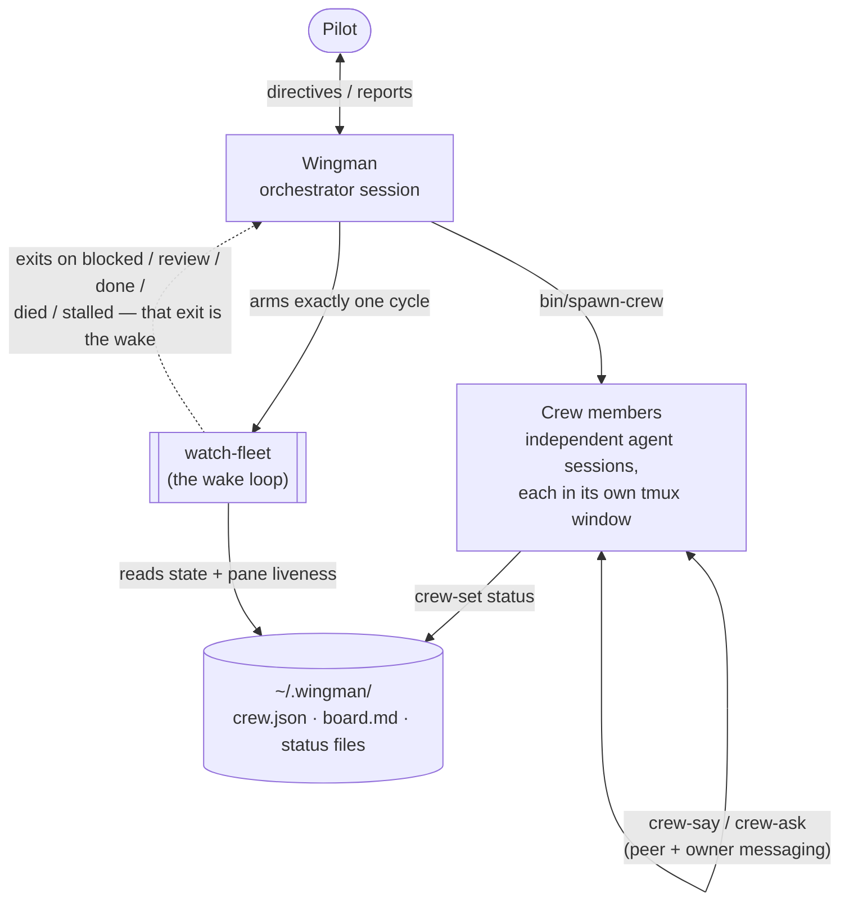
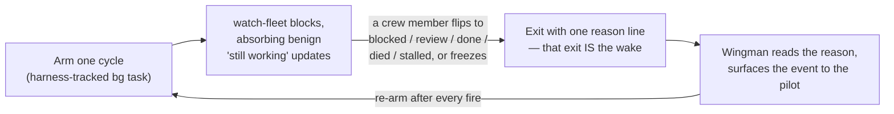
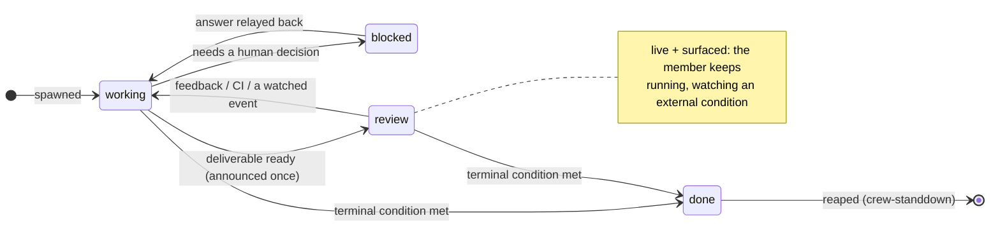
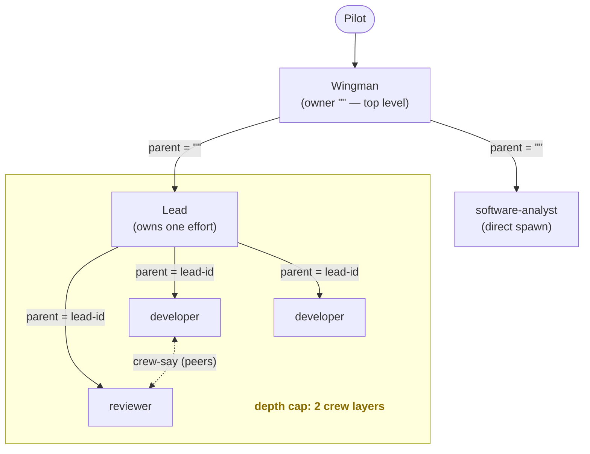

# Wingman architecture

In-depth reference for how wingman works internally.
For day-to-day use, see the [README](../README.md).

This document covers the core model - the wake loop, the deliverable lifecycle, and the crew hierarchy. Operational detail lives in focused companion docs:

- [configuration.md](configuration.md) - the launcher, the spawn recipe, model selection, and machine-local state in `~/.wingman/`.
- [guards.md](guards.md) - the mechanical `PreToolUse`/`PostToolUse` guards, checkout freshness, and autonomous mode.
- [fleet-resilience.md](fleet-resilience.md) - correlated fleet events, API-outage detection, and usage-limit-quota detection.
- [playbooks.md](playbooks.md) - crew types, categories, and local overrides.

## Overview

Wingman is a long-lived orchestrator session that delegates real work to a crew of independent agent sessions and is woken only when one needs attention. The pieces and how they relate:

State lives on disk, not in wingman's transcript, so it survives compaction and restarts; the watcher is event-driven, so an idle fleet costs no tokens. The rest of this reference details each piece.

## Remote Control

Claude Code's Remote Control lets a session be reached from `claude.ai/code` or the Claude desktop/mobile apps, not only via `tmux attach`.
Wingman wires this up in both directions:

- Every crew member launches with `--remote-control "wm-<id>"` (`bin/spawn-crew`, gated by `WM_REMOTE_CONTROL`, on by default) - the `wm-` prefix matches its tmux window name, so it reads identically in both places.
  This fails soft: on an account that can't use Remote Control, the session just starts normally with it quietly unavailable.
- A crew member's own dropped connection self-heals: `bin/watch-fleet`'s `remote_control_dropped_check` recognizes the disconnect banner in that member's pane and automatically retypes `/remote-control` to restore it.
- Wingman's own connection is watched differently, on purpose: `self_pane_check` can see wingman's own disconnect banner but deliberately never types into wingman's own pane - doing so from outside would race the very tool call meant to send the reconnect command.
  Instead it wakes wingman with an explicit `remote-control-dropped` event, and wingman tells the pilot to run `/remote-control` themselves.
- There is no reliable way to detect programmatically whether a given session is being watched locally or over Remote Control at any moment - see [`docs/analysis/2026-07-13-remote-control-transport-detectability.md`](analysis/2026-07-13-remote-control-transport-detectability.md) - which is why wingman asks once, up front, rather than guessing.

## Harness-agnostic by design

The **crew** coordination layer - tmux windows, the JSON status files, the watcher loop, and the board - does not depend on any one agent harness.
A crew member is just an agent CLI running in a tmux window that keeps its status file current.

The default launch recipe uses the `claude` CLI and its flags, and that is the single place to change for a different harness: it is isolated in `bin/spawn-crew` and overridable via `WM_AGENT`.
Wingman deliberately avoids a harness's native background-agent/attach/resume features to run or take over *crew*, because that would wed the crew layer to one harness. tmux attach is the takeover path precisely because it is neutral - it reaches whatever agent CLI is in the window.

The one thing that is legitimately harness-specific is **how the watcher wakes wingman** (see below) - a private loop between wingman and its own supervisor, not part of the crew layer.
Swapping harnesses means swapping that one arming primitive, exactly as it means swapping the `WM_AGENT` launch line; both are isolated, neither leaks into the crew coordination layer.

## The wake loop

A file on disk cannot rouse an idle session, so the only reliable way wingman is woken when crew need it is the **completion of a task the harness tracks**.

The watcher, `bin/watch-fleet`, is built for exactly this:

- It **blocks** - watching status files and window liveness, silently absorbing benign "still working" updates - and **exits with one reason line** the instant a crew member flips to `blocked`/`review`/`done`/`died`/`stalled` or freezes on a prompt.
  One run is one *cycle*.
- It is armed as a **harness-tracked background task** (e.g. Bash `run_in_background`), on its own, never bundled onto the tail of another command.
  Because the harness tracks it, its exit re-invokes wingman - that exit **is** the wake.
  It is never run detached (`nohup`/`&`); a detached process cannot wake an idle session.
- On each wake, wingman reads the reason line and `~/.wingman/wake`, surfaces the event to the pilot, then **arms exactly one fresh cycle**.
  The chain persists only if it re-arms after every fire.
- The arm's status line is truth: `armed` (a fresh cycle is now blocking), `healthy` (a live cycle already exists - do not start another), or a `blocked:/review:/done:/died:/stalled:` reason (it fired).
  An atomic claim (an `mkdir`-based lock, verified with a write-then-read-back pass rather than trusting `mkdir` alone) makes two near-simultaneous arms resolve to exactly one live cycle, never two.
  The watcher checks for pending events the moment it arms, so a crew member that finishes in the gap between one fire and the next arm is surfaced by that arm, not lost.

The watcher also detects a crew frozen on a permission or trust prompt - a terminal-UI stall the status files can't see - and flips it to `blocked`. A second, distinctly-worded regex (`WM_RESUME_PROMPT_RE`) layered onto the same generic dialog-shape detector recognizes one further freeze: the CLI's own "resume from summary?" menu, which a `claude --resume` relaunch of a long-transcript session can land on (issue #30). That gets its own specific `blocked` wording (needs one keypress via `bin/crew-takeover`) rather than the generic permission/trust one, so an automated resume attempt that silently froze there is never misreported as a healthy `working` member.
It detects a member gone silently idle (no pane output, no status update, no execution in its process tree) and, before flipping it to `stalled`, sends it a one-shot check-in nudge - a plain message into its pane, worded for an API/connectivity-error signature (a rate limit, a 5xx, a connection reset) if the pane tail shows one, generic otherwise - and waits a full cooldown window for activity; only silence through that whole window confirms the flip. This lets a transient outage, or any other self-resolvable hiccup, self-heal where possible instead of paging the pilot immediately.
The nudge also stamps a `nudged_at` timestamp onto the member's own status record (via the same per-poll `stall-check` call, not a second subprocess), so a still-`working` member mid-self-heal renders as `working (self-heal nudge sent Xs ago)` in `crew-list`/`board.md` instead of a bare `working` - the nudge marker file was a private sidecar the watcher alone read, so this state used to be invisible to a human or an owning lead until it either resolved or escalated (issue #155). `stall-check` also tracks the elapsed time of the single longest-lived qualifying descendant process on every poll, independent of the idle-nomination gates above (a single outstanding tool call or background shell keeps Claude Code's own pane repainting via its "N shell(s) still running" indicator, so the idle gates may never trip at all): once that elapsed time crosses `WM_LONG_SHELL_WARN` (a generous, configurable render-time ceiling, default 20 minutes), the same rendering annotates `working (1 shell running Xm, longer than usual)`. Neither annotation ever causes a `blocked`/`stalled` flip - both are purely informational, since a legitimately long build or test run is not itself an error.
A crew session also cannot itself open a second, independent human-wait state by calling `AskUserQuestion`/`EnterPlanMode`/`ExitPlanMode` - see [guards.md](guards.md)'s `hooks/no-interactive-prompt-guard.sh` - so the nudge-and-wait mechanism above exists for genuine idle self-heal, not as a workaround for a crew session stuck on a prompt nobody can answer.

When the **same** signal hits many crew at once - a mass death, a correlated API-error stall, an outage, or an approaching usage-quota window - the watcher collapses or escalates it rather than paging per member, and pauses new spawns where appropriate. That machinery is documented in [fleet-resilience.md](fleet-resilience.md).

## The deliverable lifecycle and `review`

A crew member is not spun down the moment its deliverable appears; one session sees a piece of work through from creation to final disposition.
The **state model is defined once** in the shared status contract (`playbooks/_status-contract.md`), which is appended to every crew brief; playbooks describe only the work, not how to move between states.

The status state machine (`bin/lib/wm-state.py`) encodes the same states:

- `LIVE_STATES = (working, blocked, review, stalled)` - a member in any of these is still in flight and stays on the board's Active list.
- `working` is active work in flight - producing, revising, or seeing through work (e.g. CI) that must conclude before the deliverable is ready.
  It is never surfaced, so summary refreshes here don't wake the pilot.
- `review` is the parked-and-waiting state: the deliverable is produced and surfaced, and the member is now watching an external condition it does not control (a PR merge, a plan approval).
  It is both **live** and **surfaced** - `needs-attention` (`ATTENTION_STATES`) announces it to the pilot once per entry, exactly as `blocked` is announced, but the member keeps running.
  A member moves back to `working` to act on an event (review feedback via `crew-say`, a CI failure) and returns to `review` when it settles.
  The dedup key `needs-attention` actually reads is `announced`, not `updated`: `announced` advances on a genuine transition into an attention state, and - for `review` specifically - also on a material change to its `artifact`/`blocker`/`delivery` pointer, but not on a same-status `review` refresh that only touches `summary`.
  `blocked` and `done` are unscoped by this gate: `--silent` is forbidden for them, so every non-silent call announces.
  This is why a re-delivery that answers feedback on an already-`review` deliverable must transition out of `review` and back (through `working`), not restate `--status review` directly: only the transition, or a changed pointer, re-announces.
  Idle time in `review`, or a same-status summary-only refresh, writes nothing new to surface, so a parked member never spams.
- `done` means the terminal condition is met and the member is ready to be reaped: a plan approved/handed off, or a PR merged/closed.
  A ready deliverable is `review`, never `done`.

The lifecycle is uniform across types - deliver → `review` → drop to `working` to act on feedback and back → `done` - and each playbook names its own deliverable, dependency-to-watch, and terminal condition; the contract supplies the state mechanics.

Wingman holds **no** waiting logic itself: it recognizes crew status updates and surfaces the meaningful ones, and it spins a member down in exactly two cases - the member reports `done` (the watcher detects it; wingman relays the outcome and reaps it with `crew-standdown` **in the same turn**, so `done` is transient on the roster and finished members never pile up), or the pilot stands it down explicitly.
Nothing else reaps a member.
*How long* and *why* a member stays alive after delivering is entirely the playbook's concern; wingman only avoids cutting it short.

## The crew-level wake loop (PR shepherding)

A developer member's "seeing it through" often means watching its own PR, and it uses the same wake primitive wingman uses on itself, one level down.
`bin/pr-watch` is **one available, forge-specific** dependency-watcher for PR-shaped delivery, not a mandated step: after opening a PR a member *may* arm it as a **harness-tracked background task** (never detached) to be woken on forge state.
It blocks, polling the PR through the forge CLI, and exits with one reason line (`merged` / `closed` / `changes-requested` / `ci-failed` / `comment` / `checks-passed`) the instant an actionable event occurs; that exit re-invokes the crew member, which acts and arms exactly one fresh cycle - the identical arm-one-cycle discipline as `watch-fleet`.
Inter-agent **review** feedback, though, travels over wingman's own channel (`crew-say`) by default, not the PR: a reviewer reports its verdict to whoever commissioned it, and a parked developer is woken by that incoming message rather than by pr-watch spotting a comment.
The `changes-requested`/`comment` reasons therefore only carry review feedback when the human has opted into writing to the forge (`pr_comments=on`); in the default flow pr-watch is effectively just a CI/merge/close watcher, and a developer whose delivery has no forge signal to watch arms no watcher at all.
`checks-passed` fires once when the PR settles with nothing failing and nothing pending (all-green, or a repo with no CI), which is what lets a member stay `working` through CI and be woken to move into `review` only when it is genuinely on the humans; it re-arms once checks go pending/failing and settle again.

A cursor at `$WINGMAN_HOME/pr/<crew-id>.json` records what has already been surfaced, so a persistently-red build or an already-handled comment does not re-fire, and this session's own replies never wake it - identified by an anchored `<!-- wingman-crew:<id> -->` marker matching its own crew id, not by forge login alone (every crew session shares one forge login, so login alone would also drop a human's own genuine comments or a different crew member's own genuine review).
Firing advances only the fired dimension, so a co-occurring lower-priority event still surfaces on the next cycle.
The event-decision logic lives in `bin/lib/pr-eval.py` (pure, unit-testable with canned JSON); `bin/pr-watch` is the thin poll loop around it.

This keeps the two watch loops cleanly separated at different levels: `watch-fleet` is wingman's channel to its crew (forge-agnostic), `pr-watch` is a crew member's channel to the forge.
The forge-specific part is isolated in `pr-watch`'s `gh` calls, overridable via `WM_GH` (point it at another binary or wrapper), exactly as the agent launch line is isolated in `spawn-crew` behind `WM_AGENT`; a non-GitHub forge swaps this one script.
Analyst (and other non-PR) members have no external signal to poll, so they arm no watcher - they idle in `review` until the pilot's feedback arrives via `crew-say`.

## The crew hierarchy (leads)

Wingman's crew is a **tree**, with the pilot at the top. A large effort is owned by a **lead** - a crew member whose playbook is "be a manager for one effort." A lead runs the *same* intake → scope → spawn → supervise → report → escalate loop wingman runs, one layer down, over its own crew (a software-analyst, an architect, one or more developers, a reviewer). This is recursion over the existing primitives, not a parallel subsystem: the lead uses the same `bin/` scripts and the same watcher.

Each layer sees only its direct reports (`blocked` escalates one hop up; a lead rolls a single line up to wingman). Wingman and the pilot are not crew layers, so the two crew layers are the lead and its workers; a lead does not spawn further leads.

**Ownership falls out of who spawns.** Every crew record carries a `parent` field, stamped by `bin/spawn-crew` from the spawner's `$WINGMAN_CREW_ID`. Wingman has none (it is the top orchestrator), so its spawns get `parent=""` (top level); a lead has its own id, so its spawns get `parent=<lead-id>`. No new flags - the tree is implicit in who ran the spawn.

**Each layer sees only its direct reports.** Surfacing (`needs-attention --owner`), the watcher, and the default `crew-list` are all scoped to an owner (`""` = top level). Wingman's watcher runs `--owner ""` and sees only the top level (including a lead's rolled-up line); a lead's watcher runs `--owner <lead-id>` (the default from its own `$WINGMAN_CREW_ID`) and sees only its own workers. The pidfile/beacon/wake are keyed by owner (`watch-<owner>.*`, `wake-<owner>`; wingman keeps the legacy unsuffixed names), so wingman's watcher and each lead's watcher coexist without contending. Drill-down is always available: `crew-list --owner <id>`, `crew-list --tree`, and the tree-rendered `board.md`.

**Escalation is recursive human-in-the-loop.** A worker that sets `blocked` surfaces to its owner (its lead), not to the pilot. The lead answers via `crew-say` if it can; if the decision is above its pay grade, it re-raises `blocked` on its *own* line, which surfaces one level up. Decisions travel up only as far as needed; the answer flows back down the same chain. Cascade stand-down mirrors this: standing down (or reaping) a member recurses to its descendants, so finishing a lead never orphans its sub-crew.

**Peers collaborate directly.** Siblings under the same lead `crew-say` each other for routine coordination (a developer↔reviewer exchange, a developer↔developer interface negotiation) without routing through the lead - which would pour their detail into the lead's context, the exact bloat the hierarchy prevents. The lead sees only the rolled-up outcome unless a genuine decision escalates. A guardrail in `crew-say` keeps collaboration within a team: a caller may message its own reports, a sibling under the same lead, or its own lead - not arbitrary crew elsewhere in the tree (override with `--force`).

**Depth cap: two crew layers.** The full chain is pilot → wingman → lead → worker; wingman and the pilot are not crew layers, so the two crew layers are the lead and its workers. A lead does not spawn further leads; deeper nesting is a future opt-in gated behind cost guardrails.

**Domain generality.** The tree, escalation, rollup, and owner-scoping know nothing about software; only the playbooks carry domain (see [playbooks.md](playbooks.md)). The playbook library ships this as a first-class taxonomy rather than a hypothetical: category subdirectories under `playbooks/` (`ai-research`, `data-science`, `scientific-research`, `business-development`, `business-operations`, alongside `software-development`) each carry a domain-appropriate pipeline, so a science lab (experimental-designer → experimentalist → analysis-scientist → peer-reviewer) or a business team (market-analyst → gtm-strategist → partnerships-rep) runs the same machinery out of the box. Adding a further domain is still a playbook swap, not a code change: reuse the default role names with domain-appropriate `*.local.md` prose, or add named roles (`playbooks/<category>/pi.md`, …) and a `lead.local.md` that sequences them. The lead playbook is written in role-and-handoff terms ("gather requirements → design → execute → review → integrate") with software as the concrete default.

## Survival & reconciliation

The tmux **server** owns the crew windows, so killing wingman does not kill the crew.
Every session and window target is exact-match (`-t "=name"`; tmux otherwise resolves bare names by prefix, which is how crew once landed inside a similarly-named session - issue #39), and `bin/spawn-crew` guarantees the crew session itself exists before creating a window in it.
On any startup wingman reads `~/.wingman/crew.json`, reconciles against the live windows (`bin/crew-list` does this automatically), re-arms the watcher if crew are in flight, and reports the current roster.
Before judging liveness, reconcile callers adopt strays: a roster member's window found in another tmux session is moved back into the crew session (`tmux move-window`, process intact), so a live member is never reported `died` merely for sitting in an unexpected session (issue #44).
A crew member whose window died shows as `died` and is recoverable either by hand (`bin/crew-takeover <id>` prints the exact resume command) or in bulk via `bin/crew-resume <id>...` / `bin/crew-resume --all-died`, which relaunches it (or every died member) with `claude --resume <session-id>` and verifies the relaunch actually took before flipping it back to `working`.
`bin/spawn-crew` itself only ever reports success once the `crew-add` write is confirmed readable back (a captured exit-status check plus a `crew-get` read-back; either failure tears the just-created window down and dies loudly) - a live, untracked session with no roster record is the failure mode this closes (issue #79).
As a backstop for the remaining ways a record can still go missing (a crash between window creation and `crew-add`, or a window created outside `bin/spawn-crew` entirely), wingman's own reconcile pass (`--owner ""` only) also tracks any live `wm-*`-prefixed window with no matching roster record in `orphan-candidates.json`, and adopts it as a `blocked` roster-only record once it has stayed unmatched past `--grace-seconds` (default 15s) - long enough that an ordinary in-flight spawn, whose window always exists a moment before its `crew-add` lands, is never mistaken for a genuine orphan.

## Tests

`bash tests/run.sh` runs the bash E2E suites.
No real `claude`/tmux fleet is needed; each test uses an isolated throwaway state home and tmux session name.
They cover:

- the wake loop (`watch-fleet` blocks, fires on an actionable event, singleton guard, an atomic claim so two near-simultaneous arms never both win),
- terminal-event de-duplication (an event surfaces once, re-surfaces only on a state change),
- repo-vs-global spawn scope,
- roster views and cleanup (`crew-list` hides `stood-down` by default, `--all` reveals it; `crew-prune` archives + removes terminal records),
- silent-stall detection (the staleness gates, the execution probe, and the API-error reason flavor + nudge-then-escalate flow),
- nudge visibility and the long-shell duration ceiling (`nudged_at`/`long_shell_*` tracked and cleared correctly, `crew-list`/`board.md` annotating a still-`working` member without ever causing a flip) and the interactive-prompt guard's crew-vs-top-level scoping,
- correlated-event grouping (`group-attention` collapsing a mass-death or API-outage batch into one bullet) and bulk recovery (`crew-resume`, including its idempotency guards and tree preservation),
- PR-event evaluation including `checks-passed` (fires once on green / no-CI, re-arms after a new failing/pending rollup),
- confirmed-write spawning and orphan recovery (issue #79): `bin/spawn-crew` tears down its window and fails loudly on a `crew-add` failure or a failed verify-after-write read-back; `with_locked` propagates a real `flock()` failure instead of swallowing it; `wm_state reconcile` adopts an orphaned `wm-*` window as `blocked` only once it has genuinely outlasted the grace period, never a healthy in-flight spawn.

Requires `bash`, `git`, `tmux`, and `uv`.
