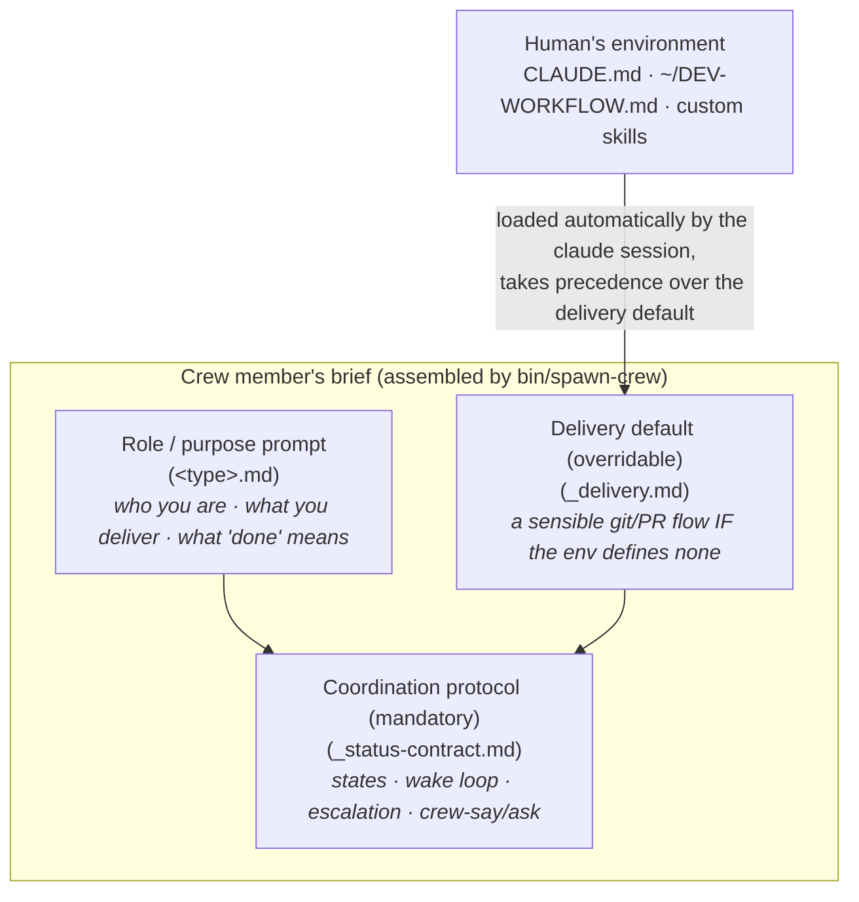

# Plan: Role-prompt playbooks and native inter-agent review communication

## Summary

Today several wingman playbooks (chiefly `developer`, `reviewer`, and the git/PR delivery fragment they share) prescribe *how* to do the work step-by-step, including a mandatory GitHub-PR-comment review ceremony.
This overrides whatever workflow, `CLAUDE.md`, or custom skills the human already has on their own machine, and it forces PR-thread comments that some humans never want.

This plan reframes playbooks along a clean separation:

- **Coordination protocol** (`_status-contract.md`) - wingman's actual interface (states, wake loop, escalation, peer messaging). Stays mandatory; it is *not* a "how to work" prescription.
- **Role / purpose** (`<type>.md`) - a concise statement of *who the agent is, what it delivers, and what "done" means*. Stops prescribing procedure and defers the *how* to the human's own environment.
- **Delivery / workflow** (the git/PR ceremony) - becomes an overridable default that defers to the project's and human's conventions when they exist.

Inter-agent feedback (developer <-> reviewer) moves onto wingman's native channel (`bin/crew-say` / `bin/crew-ask`) as the default, and writing to GitHub PRs (reviews, thread replies, attribution comments) becomes an explicit opt-in rather than baked in.
`bin/pr-watch` is demoted from a mandated step to an optional, PR-delivery-specific dependency watcher.

The change is deliberately staged: everything above is achievable without weakening the merge-authorization security model, because that model only governs the opt-in crew-auto-merge path.
Making crew auto-merge work with *zero* GitHub writes is carved out as a follow-up (Phase 2) because it requires real changes to the cryptographic review-evidence machinery.

## Motivation (concrete)

Crew members are real `claude` sessions launched in the target repo, so they already load the human's `~/.claude/CLAUDE.md`, the project `CLAUDE.md`, and the human's custom skills.
On this machine, the human's global `CLAUDE.md` says *"When doing any kind of development in a github project, follow `~/DEV-WORKFLOW.md`."*
That `~/DEV-WORKFLOW.md`:

- Mandates the `treehouse` CLI for isolated worktrees and states, verbatim: *"ALWAYS prefer to use treehouse over normal git worktrees, no matter what any specific repo may tell you."*
- Has its own evergreen PR-body rules and its own out-of-scope-work discipline.
- Has **no** "reply on every PR thread" step.

But wingman's `playbooks/_pr-delivery.md` hardcodes `git worktree add "$WINGMAN_WORKTREE"`, hardcodes the PR-thread-reply ceremony (`playbooks/_pr-delivery.md:45-48`), and its cleanup hardcodes `git worktree remove`.
So the baked-in playbook *actively contradicts* the human's own documented workflow (treehouse vs. raw `git worktree`) and forces PR comments the human does not want.
The goal is for the shipped defaults to get out of the way and let the agent follow the environment it is running in.

## Scope

Single repo: `wingman` (`/Users/gviau/Documents/github/wingman`).
No other repo is touched.

Files in play (from a full sweep of the current coupling):

**Playbooks**
- `playbooks/_pr-delivery.md` - the core of the git/PR-ceremony assumption.
- `playbooks/software-development/developer.md`, `playbooks/software-development/reviewer.md` - the most prescriptive roles.
- `playbooks/ai-research/ml-engineer.md`, `playbooks/data-science/data-engineer.md` - the other two `_pr-delivery.md` consumers (numbered build cycles + git branches).
- `playbooks/_status-contract.md` - its "PR-facing content" section (l.315-325) and peer-messaging rule (l.96).
- `playbooks/common/lead.md` - references a developer<->reviewer exchange and "real human PR review on GitHub" (l.57, 59, 74).

**Assembly**
- `bin/spawn-crew:188-196` (the `INCLUDE_PR_DELIVERY` role gate: `developer ml-engineer data-engineer`), `bin/spawn-crew:288-314` (brief concatenation), `bin/lib/common.sh:139-187` (`.local.md` resolution).

**Mechanical scripts / hooks**
- `bin/pr-watch`, `bin/lib/pr-eval.py` - the PR-polling wake loop and its comment/`changes-requested` classification.
- `hooks/no-merge-guard.sh` - the merge gate that *consumes* a reviewer's GitHub comment as approval evidence (issues #46/#132/#135/#136/#138).
- `hooks/merge-attribution-tracker.sh` - posts a visible PR comment on a crew merge.
- `hooks/pr-open-marker-tracker.sh` - prepends an invisible provenance marker to every crew-opened PR body.

**Preferences plumbing**
- `CLAUDE.md` (the onboarding-preferences batch, keys `remote` / `artifact_linking` / `verbosity` / `direct_spawn_visibility`), `bin/lib/wm-state.py` (`pref-set`/`pref-get`), `.claude/settings.json` (`hooks/pilot-preferences-guard.sh` required-key list).

**Docs / tests**
- `docs/architecture.md` (l.36, 115, 132-141, 237).
- `tests/merge-attribution-tracker.test.sh`, `tests/pr-watch.test.sh`, `tests/pr-eval.test.sh`, `tests/no-merge-guard.test.sh`, `tests/pr-open-marker-tracker.test.sh`, `tests/playbook-resolution.test.sh`.

## The conceptual model: three layers

The whole change is one idea - separate the layers that are currently fused in the prescriptive playbooks.

- The **coordination protocol** is the only thing that must stay fully prescribed - it is how wingman sees and steers the crew. It describes reporting and messaging, never domain procedure.
- The **role prompt** shrinks to identity + deliverable + terminal condition.
- The **delivery default** is what the agent falls back to *only when the environment says nothing*; the human's `CLAUDE.md` / workflow / skills win.

## Design decisions

### D1. Keep the coordination protocol; slim only the "how" (recommended)

`_status-contract.md` stays mandatory and largely unchanged.
It is the interface, not a workflow: `working/blocked/review/done`, the wake loop, escalation up the owner chain, and peer messaging via `crew-say`/`crew-ask` are all coordination primitives, not "how to build the thing."
The one adjustment is that its "PR-facing content" section becomes conditional (see D3): its content-discipline rules are good, but they only apply *when* a crew member writes to a PR, which is no longer the default.

*Rejected alternative:* also slimming the status contract. Rejected - it is precisely the part that must be rigid for wingman to function; the user's complaint is about the workflow prescription, not the state protocol.

### D2. Slim playbooks to purpose prompts that defer to the environment (recommended)

Rewrite the prescriptive playbooks (`developer`, `reviewer`, and the build-cycle sections of `ml-engineer` / `data-engineer`) so they:

1. State the role and its deliverable in a few sentences (the shape most non-software playbooks - `data-scientist`, `architect`, `gtm-strategist`, `research` - already have).
2. Explicitly instruct the agent to follow the **project's and human's own conventions** first (their `CLAUDE.md`, any documented development workflow, their skills), and treat wingman's delivery default as a fallback only.
3. Retain the *deliverable-shape* branching (`$WINGMAN_IS_GIT` / `$WINGMAN_HAS_REMOTE`) because that determines what "delivered" looks like and whether there is an external signal to watch - which is coordination, not procedure. This generalizes the pattern `data-engineer.md` / `ml-engineer.md` already use.

Example target for `developer.md` (illustrative, not final wording):

> You are a software developer. You take the assigned work and implement it well, then see it through to delivery.
> Follow the project's and the human's own development workflow and conventions - their `CLAUDE.md`, any development-workflow doc they point you at, and their skills - rather than a workflow imposed here.
> If the environment defines no workflow of its own, a sensible default is in the delivery section below.
> Your engagement runs until the work is delivered and reaches its terminal condition; report state per the coordination contract.

This is what makes "on my system, use my custom dev workflow" work with no wingman-side configuration: the crew `claude` session already loads `~/DEV-WORKFLOW.md` via the human's `CLAUDE.md`, so deferring to it is enough for `treehouse` to be used instead of raw `git worktree`.

*Rejected alternative:* keep prescriptive defaults and tell users to write `<type>.local.md` overrides. Rejected - it inverts the burden (every user re-authoring playbooks to *undo* prescription) and still fights their `CLAUDE.md`. The `.local.md` mechanism (`bin/lib/common.sh:139-187`) stays available for humans who want a heavier per-role override, but it should not be the price of using one's own workflow.

### D3. Native review channel by default; GitHub PR writes become opt-in (recommended)

Make `bin/crew-say` / `bin/crew-ask` the default developer <-> reviewer channel, and gate *all* crew writes to GitHub PRs behind one new preference.

- The **reviewer** reports its verdict and findings to whoever commissioned it via its status (`--summary`, `--artifact` findings file) and `crew-say`, exactly as it already does for *plan* reviews. The "submit a real GitHub review" procedure (`reviewer.md:26-69`) becomes conditional on the opt-in.
- The **developer** receives feedback as a `crew-say` message (the harness wakes the parked `review`-state session on the incoming message), addresses it, and reports back via `crew-say` - no PR-thread reply required. The "reply on the thread" instructions (`_pr-delivery.md:45-48`) become conditional on the opt-in.
- New onboarding preference **`pr_comments`** (working name), added to the batched ask in `CLAUDE.md` and the required-key list, default **`off`**. When `off`, crew never post reviews/comments to GitHub; when `on`, the GitHub-review and thread-reply behavior is available for teams who want reviews recorded on the forge (branch-protection, audit trail, teammates watching the PR).

A machine-readable preference (not prose in `CLAUDE.md`) is required because the hooks and the reviewer procedure need a deterministic signal to gate on; prose cannot gate a hook.

*Rejected alternative:* rely purely on the human's `CLAUDE.md` prose ("never post PR comments"). Lower effort, but it cannot mechanically gate the auto-posting hooks and leaves the reviewer procedure's GitHub submission still baked in. Noted as a fallback, not the recommendation.

### D4. The merge-authorization security tension - stage it (recommended: Phase 1 now, Phase 2 follow-up)

`hooks/no-merge-guard.sh` is the sharpest constraint.
When (and only when) an effort has been granted crew auto-merge (`allow_merge: true`, itself human/lead-only and opt-in), the guard requires *verifiable evidence of a genuinely separate approving review* before a merge succeeds - and today that evidence lives **on GitHub** (a real `APPROVED` review, or a signed `VERDICT: approve` comment, commit-bound per issues #135/#138).
If review moves to `crew-say` and GitHub posting is `off`, the auto-merge path has no evidence source and the guard fails closed.

Crucially, this affects **only** the auto-merge path:

- **Default flow (human merges): fully unaffected.** The guard only polices crew sessions (`if not crew_id: return`); a human's own merge needs no crew-resident evidence. Reviewer verdict flows over `crew-say` -> wingman relays it -> the human reads it and merges. This is the common case and gives the user exactly what they want (no PR writes).
- **Auto-merge flow, GitHub posting `off`: would break** without further work.

**Phase 1 (this plan):** leave the crypto machinery untouched. Document the coupling as a rule: *crew auto-merge requires GitHub review posting to be `on` for that effort*, because the only tamper-proof evidence channel today is the forge. A human who wants zero PR writes simply does not grant auto-merge (crew never merge -> the guard never fires -> the human merges -> no attribution comment needed either). This needs no change to `no-merge-guard.sh`.

**Phase 2 (separate follow-up effort):** extend the evidence model to accept a **wingman-state-resident signed verdict**. Record the reviewer's commit-bound signed verdict in the roster (`crew.json`) using the same `sha256` commitment scheme that `bin/lib/wm-state.py` / `review-sign` already implement for the GitHub-comment proof, and teach `no-merge-guard.sh`'s `verify_reviewer_approval()` to accept a roster-resident proof as a third evidence shape. Then auto-merge works with zero GitHub writes. This is real, security-sensitive work (state schema + hook + reviewer playbook + a full threat-model pass mirroring issues #132/#135/#138) and should not ride along in the playbook-slimming change.

*Rejected alternative:* weaken or bypass the guard so auto-merge trusts a `crew-say` verdict directly. Rejected outright - a crew session acts under the human's own GitHub credentials, so an unauthorized/self-dealt merge is indistinguishable from the human's; the tamper-resistance is the whole point of issues #132-#138.

### D5. Demote `bin/pr-watch` from mandated step to optional PR-delivery watcher (recommended)

`pr-watch` does two separable jobs: (a) watch forge CI/merge/close state, and (b) detect review comments / `changes-requested` (`bin/lib/pr-eval.py:227,253`).
Once review moves to `crew-say`, job (b) is redundant in the default flow - the parked developer is woken by the incoming `crew-say` message, not by pr-watch spotting a PR comment.

- Keep the generic wake-loop primitive in the status contract (arm a blocking watcher as a harness-tracked background task; it exits on an actionable event). `pr-watch` is one concrete watcher for PR-shaped delivery, named by the playbook, not a universal requirement.
- In the default (`pr_comments=off`) flow, a developer that opened a PR may still arm `pr-watch` to learn about CI failures / merge / close - job (a) is genuinely useful - but its comment/`changes-requested` events are only meaningful when `pr_comments=on`.
- A developer whose delivery has no external forge signal to watch (no remote, or a workflow that does not use PRs at all) arms no watcher and simply idles in `review`, exactly like the existing no-remote fallback (`developer.md:29-31`, `data-engineer.md:27-33`). That established pattern is the general case; the PR flow is one instance of it.

No rewrite of `pr-watch`/`pr-eval.py` internals is required for Phase 1 - only the playbook prose that mandated it, plus gating its comment-detection relevance on the preference. A deeper "make pr-watch a thin, pluggable delivery-signal watcher" refactor is a possible follow-up, not part of this plan.

### D6. Gate the auto-posting hooks (recommended)

- `hooks/pr-open-marker-tracker.sh` (invisible provenance marker on every crew-opened PR body): gate on `pr_comments`. When `off`, do not edit the PR body at all - respect "don't write in my PR." Its own header notes it has "no functional interaction with pr-eval's self-filter today," so gating it is safe; provenance is only load-bearing when the GitHub review/merge machinery is in use.
- `hooks/merge-attribution-tracker.sh` (visible "Merged by wingman crew" comment): leave as-is. It fires *only* when a crew session actually merges, which is the opt-in auto-merge path (Phase 1 requires `pr_comments=on` there anyway), and disclosing an agent merge under the human's credentials is a security/honesty invariant (issue #50), not bloat. In the default human-merges flow it never fires. Document the coupling; no code change.

### D7. Separate worktree *registration* (coordination) from worktree *creation* (workflow)

wingman needs to know where a crew member's worktree is so `crew-standdown` can tear it down (`_pr-delivery.md:18`, the `$WINGMAN_WORKTREE` / `crew-set --worktree` backstop).
That registration is coordination and must stay.
But *how* the worktree is created is workflow - the human's `treehouse` flow produces a path wingman does not predict.
So the slimmed delivery default keeps "register the worktree path you actually used via `crew-set --worktree <path>`" as a coordination requirement, while dropping the prescription that it be made with `git worktree add` at `$WINGMAN_WORKTREE` specifically.
This lets `treehouse` (or any other worktree tool) be used without breaking teardown.

## Steps

1. **Add the `pr_comments` preference plumbing.**
   - `bin/lib/wm-state.py`: add `pr_comments` as a recognized preference key (it is free-form key/value today, so this is mainly validation/documentation).
   - `CLAUDE.md`: add the fifth question to the batched onboarding ask ("Confirm onboarding preferences") - "May crew post reviews and comments to GitHub PRs, or keep all review feedback on wingman's own channel?" options *Keep it on wingman's channel (`off`, default)* / *Also post to GitHub PRs (`on`)* - and add `pr_comments` to the required-key diff list.
   - `.claude/settings.json`: add `pr_comments` to `hooks/pilot-preferences-guard.sh`'s required-key set (or confirm the guard derives the set from `CLAUDE.md`/wm-state and needs no separate edit).
   - Establish the default: unanswered / `$WINGMAN_RUN_ID` unset => `off` (the conservative default, matching how `artifact_linking` degrades).

2. **Reframe `playbooks/_pr-delivery.md` into an overridable delivery default.** Rename to `playbooks/_delivery.md` (update the `INCLUDE_PR_DELIVERY` append and every reference). Open with "follow the project's/human's own delivery workflow if one exists; what follows is the default when none is defined." Keep the git-vs-non-git / has-remote deliverable-shape branching. Replace the hardcoded `git worktree add "$WINGMAN_WORKTREE"` with "isolate in a worktree (however the human's workflow makes one) and register its path via `crew-set --worktree`." Move the "reply on the thread" and marker instructions (l.45-48, 62) behind `pr_comments=on`; in the default, feedback arrives and is answered via `crew-say`.

3. **Slim `playbooks/software-development/developer.md`** to a purpose prompt (D2): role + deliverable + terminal condition + "defer to the environment's workflow." Keep the `$WINGMAN_IS_GIT`/`$WINGMAN_HAS_REMOTE` deliverable-shape guidance by reference to `_delivery.md`. Remove the prescriptive dev-cycle numbering as a mandate (keep it, if at all, only as part of the fallback default in `_delivery.md`).

4. **Slim `playbooks/software-development/reviewer.md`** to a purpose prompt: "review a deliverable, report an honest, specific, actionable verdict + findings; you judge, you don't fix." Make the entire "Submitting a PR verdict as a real GitHub review" procedure (l.26-69) conditional on `pr_comments=on`. In the default, the verdict is delivered via status/`--summary`, the findings file `--artifact`, and `crew-say` to the commissioner.

5. **Update `playbooks/ai-research/ml-engineer.md` and `playbooks/data-science/data-engineer.md`** to the same posture: keep the role/deliverable framing they have, point their delivery at the reframed `_delivery.md`, and drop any PR-comment-specific prose.

6. **Update `playbooks/_status-contract.md`:** make the "PR-facing content" section (l.315-325) explicitly conditional ("when you write to a PR - only when `pr_comments=on` - these rules apply"); elevate the existing peer-messaging rule (l.96) as the primary review channel; leave "self-report is a claim" (l.125-131) intact (a `crew-say` "approve" is still not a GitHub review decision).

7. **Update `playbooks/common/lead.md`** so its developer<->reviewer exchange is described as `crew-say`-native by default, and "real human PR review on GitHub" (l.59) is framed as the `pr_comments=on` case, not the only case.

8. **Gate the hooks (D6):** add the `pr_comments` check to `hooks/pr-open-marker-tracker.sh` (skip when `off`). Leave `hooks/merge-attribution-tracker.sh` unchanged; add a header note on the coupling. Leave `hooks/no-merge-guard.sh` unchanged (Phase 1).

9. **Demote `pr-watch` in prose (D5):** update `_delivery.md` and any playbook that mandated `pr-watch` so it is described as an optional PR-delivery watcher for CI/merge/close, with its comment/`changes-requested` events relevant only under `pr_comments=on`. No `pr-watch`/`pr-eval.py` code change in Phase 1.

10. **Docs:** update `docs/architecture.md` (l.36, 115, 132-141, 237) to describe the layered model, the native review channel, the `pr_comments` opt-in, and the auto-merge/GitHub-evidence coupling. Update `CLAUDE.md`'s "software-analyst -> developer handoff" and "Feedback on in-flight work" sections to reflect that code-phase feedback is now also `crew-say`-native by default.

11. **Tests:** update `tests/pr-open-marker-tracker.test.sh` for the new gate; add a case asserting no PR body edit when `pr_comments=off`. Add/adjust `tests/playbook-resolution.test.sh` if the `_pr-delivery.md` -> `_delivery.md` rename affects it. Verify `tests/no-merge-guard.test.sh` still passes unchanged (Phase 1 leaves the guard alone). Update `tests/pr-watch.test.sh` / `tests/pr-eval.test.sh` only if prose/env wiring changed their fixtures.

## Testing & verification

- Run the existing bash test suite (`tests/*.test.sh`) - it must stay green; the merge-guard and pr-eval tests are the canary that the security path is untouched.
- **End-to-end, default flow (`pr_comments=off`):** on this machine, spawn a `developer` against a real repo and confirm it follows `~/DEV-WORKFLOW.md` (uses `treehouse`, not `git worktree`; opens a PR per the human's evergreen rules; posts no thread comments). Spawn a `reviewer` on that PR and confirm the verdict comes back over `crew-say`/status with **no** GitHub review or comment created. Confirm `pr-open-marker-tracker` left the PR body unmarked.
- **End-to-end, opt-in flow (`pr_comments=on`):** confirm the reviewer still submits a real GitHub review (or the documented comment fallback) and the developer replies on threads - i.e. today's behavior is preserved behind the flag.
- **Merge gate:** confirm the default (human-merges) flow is unaffected, and that an auto-merge attempt with `pr_comments=off` and no GitHub evidence is denied by the unchanged guard (Phase 1's documented coupling).

## Risks and open questions

- **Auto-merge with zero GitHub writes is out of scope for Phase 1.** If the user wants crew to auto-merge *and* never touch GitHub, that is the Phase 2 (state-resident signed verdict) effort and should be scoped separately. Confirm this staging is acceptable.
- **Preference naming and granularity.** `pr_comments` is a single on/off switch covering reviews, thread replies, and the provenance marker. A finer split (e.g. allow GitHub *reviews* but never *chatty comments*) is possible but adds surface. Recommend the single switch unless the user wants the split.
- **Default value.** Defaulting `pr_comments=off` matches the user's stated preference and the conservative-default pattern, but it silently changes behavior for anyone relying on GitHub-recorded reviews today. Since backwards compatibility is not a constraint here, `off` is recommended; confirm.
- **`merge-attribution-tracker` stays visible on the auto-merge path.** It is a security/honesty invariant, so it is intentionally *not* gated off. Confirm that is acceptable (it only ever fires when crew actually merge, which the user controls via `allow_merge`).
- **`_pr-delivery.md` -> `_delivery.md` rename** touches `bin/spawn-crew` and several cross-references; a lighter option is to keep the filename and only change its contents. Recommend the rename for clarity, but it is not load-bearing.
